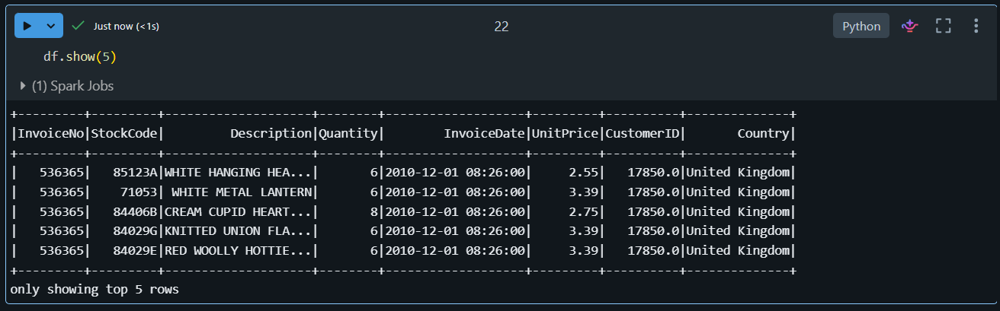
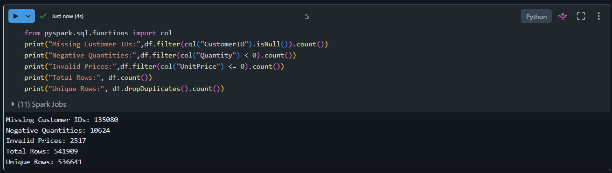
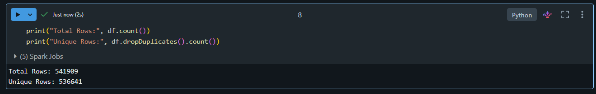
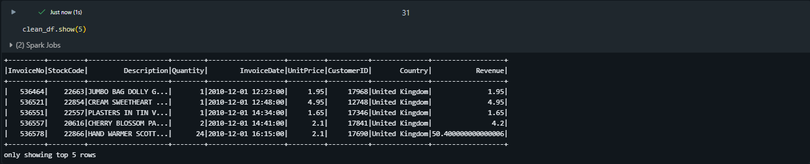
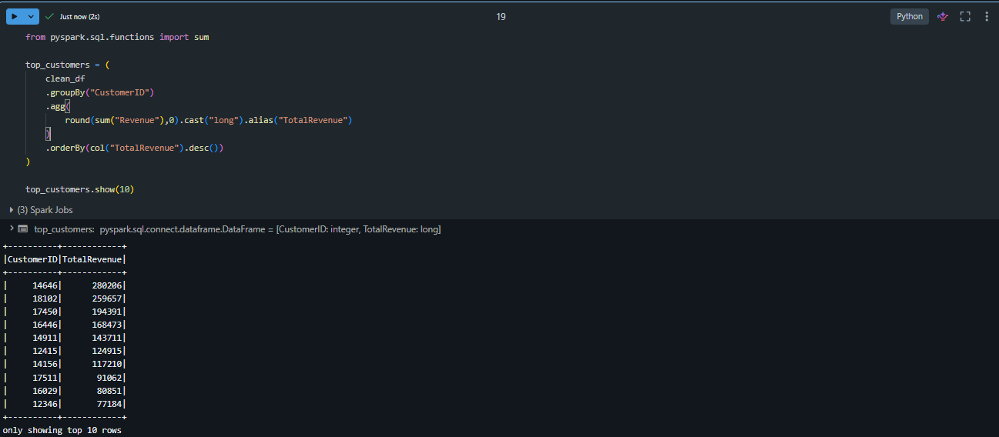
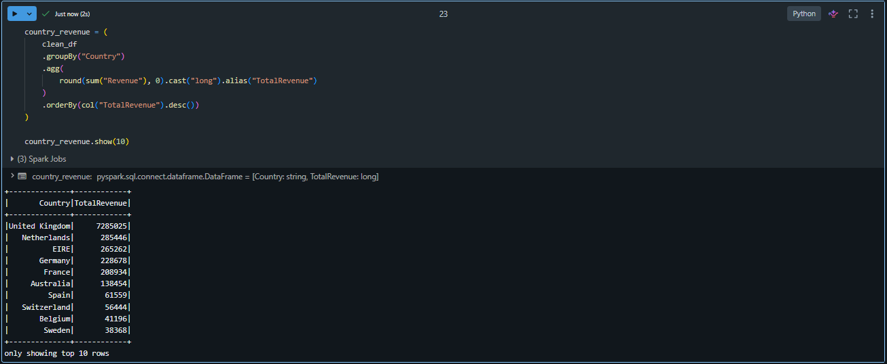
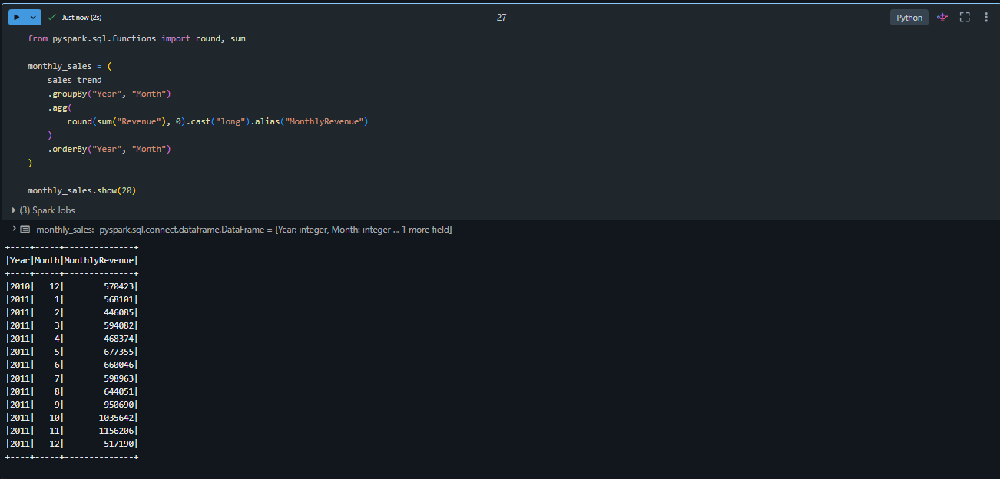

# Customer Analytics using Azure Databricks

## Project Overview

This project analyzes customer purchase transactions using Azure Databricks and PySpark. The objective was to process raw retail transaction data, perform data quality checks, clean invalid records, and generate business insights related to customer spending, geographic revenue distribution, and monthly sales trends.

The project uses the Online Retail Dataset and demonstrates core data engineering concepts including data ingestion, data exploration, data cleaning, transformations, and aggregations.

---

## Tech Stack

- Azure Databricks
- Apache Spark (PySpark)
- Python
- GitHub
- CSV Dataset

---

## Dataset Information

**Dataset:** Online Retail Dataset

### Raw Dataset Statistics

| Metric | Value |
|---------|---------:|
| Total Rows | 541,909 |
| Total Columns | 8 |

### Columns

- InvoiceNo
- StockCode
- Description
- Quantity
- InvoiceDate
- UnitPrice
- CustomerID
- Country

---

## Data Quality Assessment

The dataset was analyzed before cleaning to identify quality issues.

| Issue | Count |
|---------|---------:|
| Missing CustomerID | 135,080 |
| Negative Quantity Values | 10,624 |
| Invalid Prices (≤ 0) | 2,517 |
| Duplicate Records | 5,268 |

---

## Data Cleaning Performed

The following cleaning rules were applied:

1. Removed records with missing CustomerID.
2. Removed records where Quantity ≤ 0.
3. Removed records where UnitPrice ≤ 0.
4. Removed duplicate records.

### Cleaning Results

| Metric | Value |
|---------|---------:|
| Original Rows | 541,909 |
| Clean Rows | 392,692 |

---

## Revenue Transformation

A new business metric named **Revenue** was created using:

```text
Revenue = Quantity × UnitPrice
```

This transformation enabled customer-level, country-level, and monthly sales analysis.

### Total Revenue Generated

**£8,887,208.89**

---

## Customer Analysis

### Unique Customers

**4,338**

### Top Customer by Revenue

| Customer ID | Revenue (£) |
|------------|------------:|
| 14646 | 280,206.02 |

---

## Revenue by Country

### Number of Countries

**37**

### Top 5 Countries by Revenue

| Country | Revenue (£) |
|---------|------------:|
| United Kingdom | 7,285,024.64 |
| Netherlands | 285,446.34 |
| EIRE | 265,262.46 |
| Germany | 228,678.40 |
| France | 208,934.31 |

---

## Monthly Sales Analysis

Monthly revenue trends were calculated using the InvoiceDate column.

### Highest Revenue Month

**November 2011**

Revenue: **£1,156,205.61**

### Monthly Sales Periods Analyzed

**13 Months**

---

## Project Workflow

```text
Online Retail CSV
        ↓
Load into Spark DataFrame
        ↓
Data Exploration
        ↓
Data Quality Assessment
        ↓
Data Cleaning
        ↓
Revenue Transformation
        ↓
Customer Analysis
        ↓
Country Analysis
        ↓
Monthly Sales Analysis
```

---

## Project Screenshots

### 1. Raw Dataset Preview
Shows the original retail transaction data loaded into Spark before any processing.



---

### 2. Data Quality Assessment
Identification of data quality issues including missing Customer IDs, invalid prices, and negative quantities.



---

### 3. Duplicate Record Analysis
Verification of duplicate transactions before data cleaning.



---

### 4. Cleaned Dataset
Dataset after removing missing Customer IDs, invalid prices, negative quantities, and duplicate records.



---

### 5. Top Customers Analysis
Top customers ranked by total revenue generated.



---

### 6. Revenue by Country Analysis
Country-wise revenue distribution generated using Spark aggregations.



---

### 7. Monthly Sales Trend
Monthly revenue analysis showing sales performance over time.



## Key Learnings

- Reading large datasets using Spark DataFrames
- Performing data quality assessment
- Handling null values and duplicate records
- Applying business transformations using PySpark
- Using Spark aggregations for analytics
- Generating customer and sales insights using Azure Databricks

---
